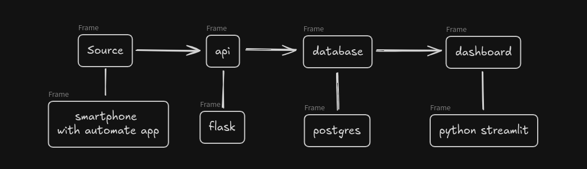
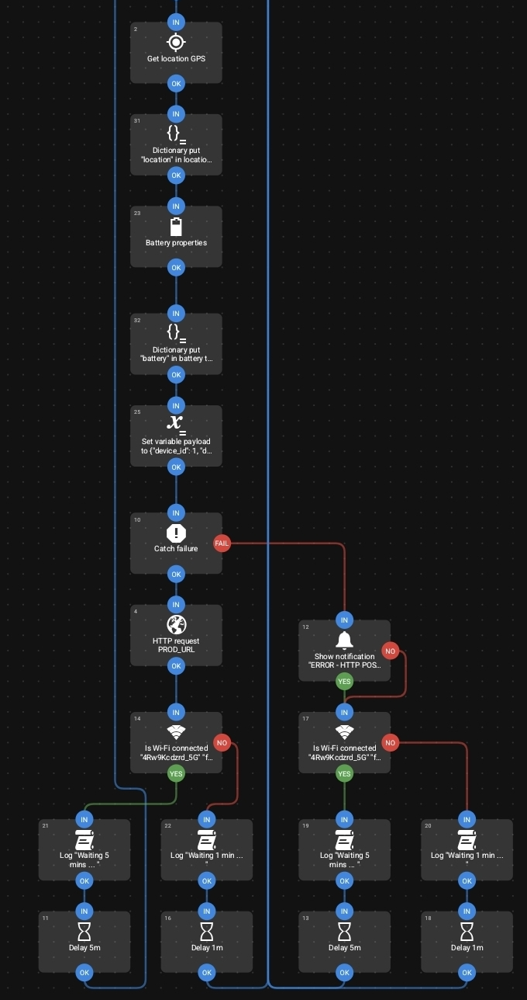
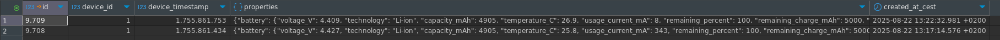
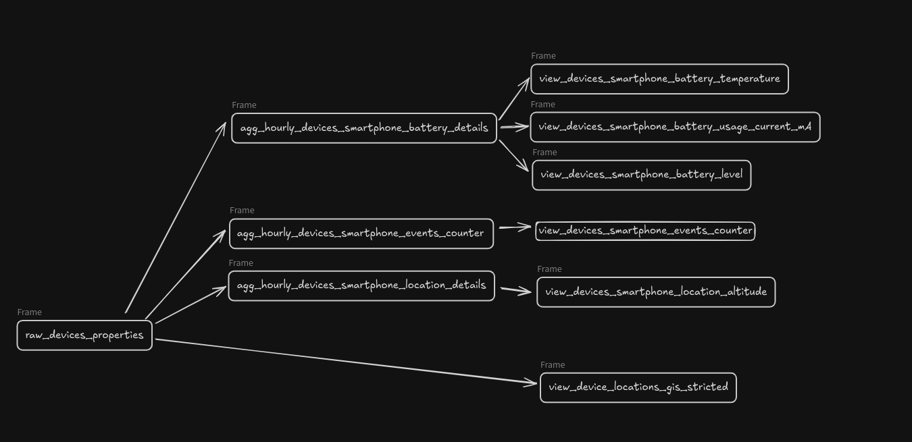
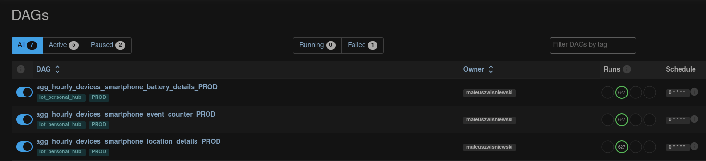

# IoT Personal Hub

## 📑 Table of Contents
- [🛠️ Technologies](#️-technologies)
- [🔄 Process Overview](#-process-overview)
- [📋 Process Details](#-process-details)
  - [📡 Sources](#-sources)
    - [📱 Smartphone](#-smartphone)
  - [🌐 API](#-api)
  - [🐘 PostgreSQL](#-postgresql)
  - [⚙️ Data processing and orchestration](#️-data-processing-and-orchestration)
  - [📊 Dashboard](#-dashboard)


## 🛠️ Technologies
- **Backend:** 🐍 Flask, 🌐 nginx (reverse proxy)
- **Frontend:** 📊 Streamlit  
- **Database:** 🐘 PostgreSQL
- **Orchestration:** 🔄 Apache Airflow
- **Deployment:** 🐳 Docker Compose
- **Hosting:** ☁️ mikr.us
- **Data Collection:** 📱 Automate (Android)


## 🔄 Process Overview



## 📋 Process Details
### 📡 Sources
The source of the project should be IoT devices used by me.
Currently, within the beta testing of the system, data is collected only from the smartphone.
I plan to add sensors from my home in the future. My dream is to connect a car to the system and collect current data from its computer, but that's rather advanced stuff.

#### 📱 Smartphone
To send data from the smartphone, I use the Automate app on Android system. I created a workflow that collects selected data and sends it to an endpoint.



For Android phones, there's also the Sensor Logger app, whose main purpose is collecting data from the phone and would probably be a more convenient choice, but the price of the Premium version was decisive.
On the other hand, Automate is an app for creating all kinds of automations. As far as I know, similar apps exist for iPhone as well.

📊 I send data from the phone every 5 minutes if I'm at home or every minute if the phone detects an internet connection through GSM network.
⚠️ The disadvantage of this solution is that in case of internet problems, data won't be sent.
💡 I'm thinking about changing the process to save data on the phone and then send it at specified intervals.


### 🌐 API
📂 [Link to API directory](https://github.com/mwisniewski1991/iot_personal_hub/tree/master/api)  
The API was created with the help of [mikr.us](https://mikr.us/), nginx, gunicorn, flask.
🖥️ The host is mikr.us where the application itself is exposed using nginx.
🔗 The API itself consists of one endpoint whose task is to save data. The endpoint is secured with an access TOKEN.
💾 Data is saved to PostgreSQL database and to minio (for now as a test to later test how this storage works).


### 🐘 PostgreSQL
🖥️ The PostgreSQL database is also hosted on VPS from [mikr.us](https://mikr.us/).
📊 The main source table is `raw_devices_properties`, created according to the script below.
ℹ️ It contains information about device id, time from device, and properties column, which can contain any data.

```sql
CREATE TABLE iot_personal_hub.raw_devices_properties (
    id SERIAL PRIMARY KEY,             
    device_id INT NOT NULL,
    device_timestamp BIGINT NOT NULL,
    properties JSONB,
    created_at_cest timestamptz not null default now()
);
```

📄 **Sample data:**  



### ⚙️ Data processing and orchestration

🔄 **Process flow:**  



Based on data from `raw_devices_properties`, 3 aggregations are created for:
- 📊 number of events, 
- 🔋 battery data,
- 📍 location data.

📂 [Link to aggregations directory](https://github.com/mwisniewski1991/iot_personal_hub/tree/master/sql_definitions/aggregations)

📝 **Sample SQL for data aggregation:**  
[Link to aggregation example](https://github.com/mwisniewski1991/iot_personal_hub/tree/master/sql_definitions/aggregations/smartphone/battery/agg_hourly_devices_smartphone_battery_details.sql)


🔄 Calculations are performed at the database level and are run using the Airflow application (it is hosted on my home Homelab).
- 📂 [Link to DAGs directory](https://github.com/mwisniewski1991/iot_personal_hub/tree/master/dags)



👁️ Then from the 3 aggregations, views are created that are retrieved by the Dashboard.
📅 The task of the views is to show the last 7 days.

```sql
create or replace view iot_personal_hub.view_devices_smartphone_battery_temperature as 
select
	device_id,
	to_char(agg.date_hour, 'YYYY-MM-DD HH24:00') as device_timestamp,
	agg.temperature_min, agg.temperature_avg, agg.temperature_max
from iot_personal_hub.agg_hourly_devices_smartphone_battery_details agg
where agg.date_hour >= (CURRENT_TIMESTAMP - interval '7 days');
```

🗺️ An additional view is data with locations, which are filtered using GIS functions with the help of the `dim_blocked_areas` table.
🔒 The `dim_blocked_areas` table contains private locations that should not be shared.

```sql
create view iot_personal_hub.view_device_locations_gis_stricted as 
with locations as (
	SELECT id,
	    device_id,
	    device_timestamp,
	    ST_SetSRID(st_point((properties #> '{location,longitude}'::text[])::double precision, (properties #> '{location,latitude}'::text[])::double precision), 4326) AS location
	FROM iot_personal_hub.raw_devices_properties dl
	where device_id = 1
	and to_timestamp(device_timestamp) >= (CURRENT_TIMESTAMP - interval '30 days')
)
select id, device_id, device_timestamp, location 
from locations
WHERE NOT EXISTS (
    SELECT 1 
    FROM iot_personal_hub.dim_blocked_areas p 
    WHERE ST_Within(locations.location, p.polygon)
);
```

Additional data stored in the database includes tables:
- dim_devices with a list of devices and their types
    - enum_device_type containing enum data for the type column from the dim_devices table
- dim_blocked_areas with a list of private zones.
📂 [Link to sql_definitions directory](https://github.com/mwisniewski1991/iot_personal_hub/tree/master/sql_definitions/ddl)


Additionally, the database contains one function set_current_timestampz_updated_at, which is responsible for updating the updated_at column in tables.
A trigger is added to each table with an updated_at column.
📂 [Link to sql_definitions directory](https://github.com/mwisniewski1991/iot_personal_hub/tree/master/sql_definitions/functions/updated_at.sql)


### 📊 Dashboard
[http://iot-personal-hub.mwisniewski1991.pl/](http://iot-personal-hub.mwisniewski1991.pl/)

📂 [Link to Dashboard directory](https://github.com/mwisniewski1991/iot_personal_hub/tree/master/dashboard)  
The dashboard was created using Streamlit and offers the following functionalities:

**Available charts:**
- 📊 **Event counter** - number of data sets sent over time
- 🔋 **Battery level** - monitoring device charge level
- 🌡️ **Device temperature** - battery temperature monitoring
- ⚡ **Current consumption** - energy usage analysis (mA)
- 📍 **Altitude above sea level** - vertical location data
- 🗺️ **Location map** - device location visualization on map

**Features:**
- 📈 Line charts with min/max ranges
- 📊 Tabular data for each chart  
- 📅 Automatic filtering to last 7 days
- 🔒 Privacy protection - filtering private locations

### 🔒 Security
- 🔑 **API Authorization** - access secured with token (sha256)
- 🛡️ **Location Protection** - automatic filtering of private areas
- 📊 **Logging** - detailed access and error logs


### 🔮 Future Plans
- 🏠 **Home sensors** - integration with home IoT devices
- 🚗 **Car data** - connection to onboard computer
- 📱 **Offline storage** - local data storage when internet unavailable
- 📊 **Extended analytics** - predictions and alerts

